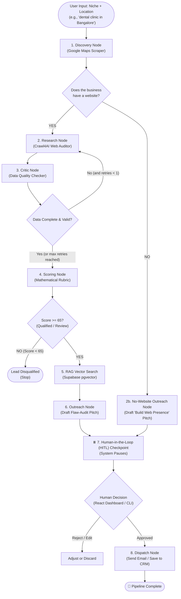

# 🚀 Lead Intelligence Engine — How It Works (Step-by-Step Guide)

Welcome to the **Lead Intelligence Engine**! This guide explains exactly how this system works from start to finish in simple, easy-to-understand terms.

---

## 💡 What is this project in simple words?

Imagine you run a digital agency or web development company. To get clients, you normally have to:
1. Search Google Maps for local businesses (dentists, gyms, plumbers, etc.).
2. Visit their websites one by one.
3. Check what's broken (is it slow? does it lack mobile booking? does it have bad SEO?).
4. Decide if they are worth reaching out to.
5. Write a customized email showing them their exact problems and how you can fix them.

**The Lead Intelligence Engine automates this entire pipeline using AI and autonomous agents.** 
It finds businesses, tests their websites, scores them, writes tailored pitch emails, and pauses for your approval before anything is sent.

---

## 🗺️ Visual Step-by-Step Flowchart



---

## 🔄 The Complete Flow: One Step After Another

---

### Step 1: Business Discovery (Finding Leads)
* **File:** [`core/scrapers/maps_discovery.py`](file:///d:/MY%20PROJECTS/lead-intelligence-engine/core/scrapers/maps_discovery.py)
* **What happens:**
  1. You give the system a **target niche** and a **city** (e.g., `"dental clinic"` in `"Bangalore"`).
  2. The system launches a headless browser using **Playwright** and searches Google Maps in real-time.
  3. It extracts key details for each business:
     - Business Name
     - Full Address & Neighborhood
     - Star Rating & Review Count
     - Phone Number
     - Website URL (if they have one)
* **Output:** A clean `DiscoveredBusiness` record for every found business.

---

### Step 2: The Decision Fork (Website vs. No Website)
* **File:** [`core/graph/workflow.py`](file:///d:/MY%20PROJECTS/lead-intelligence-engine/core/graph/workflow.py)
* **What happens:**
  The system immediately checks: **"Does this business have a website listed?"**
  * **Option A: YES** $\rightarrow$ Proceeds to deep technical research (**Step 3**).
  * **Option B: NO** $\rightarrow$ Skips website auditing and jumps directly to **Step 6B** (Drafting a special *"You don't have a website yet, here is why you are losing customers"* pitch).

---

### Step 3: Deep Technical Website Audit (Research)
* **File:** [`core/scrapers/site_crawler.py`](file:///d:/MY%20PROJECTS/lead-intelligence-engine/core/scrapers/site_crawler.py)
* **What happens:**
  For businesses that *do* have a website, the engine uses **Crawl4AI** to crawl the homepage and perform a fast 5-point technical inspection without burning any LLM tokens:
  1. **Speed & Performance:** How many seconds does the page take to load? Is it over 3 seconds?
  2. **Modern Tech Stack:** Is it built on WordPress, Shopify, Next.js, or an outdated raw site?
  3. **Conversion & CRO (Conversion Rate Optimization):** Does it have a clear "Book Appointment" or "Contact Us" Call-To-Action (CTA)? Does it offer a WhatsApp direct chat link?
  4. **SEO & Metadata:** Are the title tag, meta description, and OpenGraph social preview tags set up properly?
  5. **AI-Readiness:** Does it have Schema.org `JSON-LD` structured markup so Google and AI search engines (ChatGPT/Perplexity) can understand their services?
* **Contact Scraping:** It also automatically sweeps the site for contact email addresses and social links (Instagram, LinkedIn, Facebook).
* **Output:** A comprehensive `SiteAuditData` object containing concrete technical facts.

---

### Step 4: Quality Control & Sanity Check (The Critic)
* **File:** [`core/graph/nodes/critic.py`](file:///d:/MY%20PROJECTS/lead-intelligence-engine/core/graph/nodes/critic.py)
* **What happens:**
  Before spending money on expensive AI generation or qualifying bad data, a dedicated **Critic Agent** audits the scraped results:
  1. **Email Format & Domain Check:** Is the scraped email legitimate? Or is it a generic placeholder like `test@test.com` or `info@wix.com`?
  2. **Data Completeness Score:** Did the crawler actually get the page, or did it get blocked / return a blank page?
  3. **Fast LLM Sanity Check:** Uses a fast model (`openai/gpt-oss-120b`) to verify if the website is actually active (e.g., flagging "Domain Expired" or "Under Construction" pages).
  4. **Auto-Retry Mechanism:** If the site failed to load properly on the first try, the Critic automatically sends it back to Step 3 for one retry. If it still fails, it continues with whatever data it gathered so the pipeline never gets stuck.

---

### Step 5: Lead Scoring (Pure Mathematical Math)
* **File:** [`core/graph/nodes/scoring.py`](file:///d:/MY%20PROJECTS/lead-intelligence-engine/core/graph/nodes/scoring.py)
* **What happens:**
  The system does **NOT** ask an LLM to guess if a lead is good (which can be inconsistent). Instead, it uses a strict **deterministic mathematical formula from 0 to 100**:

$$\text{Final Score} = (0.40 \times \text{Tech Pain}) + (0.30 \times \text{Commercial Intent}) + (0.30 \times \text{Contact Quality})$$

* **What makes up each category?**
  * **Tech Pain (40% weight):** Points for having slow load times, missing WhatsApp buttons, missing JSON-LD schema, missing title tags, etc. (More flaws = higher need for our agency services).
  * **Commercial Intent (30% weight):** High Google review count and high ratings prove they are a real, thriving business that can actually afford to pay for agency work.
  * **Contact Quality (30% weight):** Points for having verified direct contact emails, phone numbers, and active social media.
* **The Qualification Gate:**
  * **Score $\ge 70$:** 🟢 **QUALIFIED** (High-priority prospect)
  * **Score $65 - 69$:** 🟡 **NEEDS_REVIEW** (Borderline lead, worth reaching out)
  * **Score $< 65$:** 🔴 **DISQUALIFIED** (Pipeline stops here — saves you from wasting time on low-value leads)

---

### Step 6: Case Study Matching & Personalized Email Drafting

#### Path A: For Audited Websites
* **Files:** [`core/rag/vector_store.py`](file:///d:/MY%20PROJECTS/lead-intelligence-engine/core/rag/vector_store.py) & [`core/graph/nodes/outreach.py`](file:///d:/MY%20PROJECTS/lead-intelligence-engine/core/graph/nodes/outreach.py)
* **What happens:**
  1. **RAG Vector Search:** The system uses local AI embeddings (`sentence-transformers/all-MiniLM-L6-v2`) and **Supabase pgvector** to search past agency case studies for the most relevant proof (e.g., *"How we helped a dental clinic in Indiranagar increase patient bookings by 3x"*).
  2. **Smart LLM Generation:** Uses Groq's high-reasoning model (`qwen/qwen3.6-27b`) to craft a cold outreach email.
  3. **No Fluff Guarantee:** The email **specifically names 2-3 exact technical flaws found on their site** (e.g., *"Your website takes 4.2 seconds to load and is missing a direct WhatsApp booking widget for mobile patients"*).
  4. It pairs these problems with the matched case study to present a compelling, data-backed solution.

#### Path B: For Businesses With No Website
* **File:** [`core/graph/nodes/outreach.py`](file:///d:/MY%20PROJECTS/lead-intelligence-engine/core/graph/nodes/outreach.py) (`draft_no_website_proposal`)
* **What happens:**
  - For businesses found on Google Maps that don't own a website, the AI drafts a specialized proposal.
  - Instead of auditing a non-existent site, it highlights how their competitors are capturing online search traffic and pitches building them a modern, conversion-ready website from scratch.

---

### Step 7: Human-in-the-Loop (HITL) Checkpoint
* **File:** [`core/graph/workflow.py`](file:///d:/MY%20PROJECTS/lead-intelligence-engine/core/graph/workflow.py) (`interrupt_before=["dispatch"]`)
* **What happens:**
  - **The system intentionally pauses right here!**
  - It will **never** automatically blast an email out to a business owner without your eyes on it.
  - The generated proposal, audit flaws, and scores wait in memory.
  - You (or the frontend dashboard) can review the email draft, tweak any sentences, or reject it.

---

### Step 8: Dispatch
* **File:** [`core/graph/workflow.py`](file:///d:/MY%20PROJECTS/lead-intelligence-engine/core/graph/workflow.py) (`dispatch_node`)
* **What happens:**
  - Once approved by a human, the email is logged, marked as approved, and handed off for delivery (via Resend/SMTP or saved to your CRM/database).
  - The lead state is saved to Supabase for historical tracking.

---

## 📊 Summary Table of Components

| Step | Component | Technology Used | Why It's Built This Way |
| :--- | :--- | :--- | :--- |
| **1. Discovery** | [`maps_discovery.py`](file:///d:/MY%20PROJECTS/lead-intelligence-engine/core/scrapers/maps_discovery.py) | Playwright (Chromium) | Live, real-world local business data with phone & location. |
| **2. Research** | [`site_crawler.py`](file:///d:/MY%20PROJECTS/lead-intelligence-engine/core/scrapers/site_crawler.py) | Crawl4AI + BeautifulSoup | Ultra-fast local HTML parsing; zero LLM token cost. |
| **3. Critic** | [`critic.py`](file:///d:/MY%20PROJECTS/lead-intelligence-engine/core/graph/nodes/critic.py) | Groq (`openai/gpt-oss-120b`) | Catches dead websites, spam emails, and triggers retries. |
| **4. Scoring** | [`scoring.py`](file:///d:/MY%20PROJECTS/lead-intelligence-engine/core/graph/nodes/scoring.py) | Pure Python Math (Weights) | 100% deterministic; eliminates LLM bias and hallucinations. |
| **5. RAG Search** | [`vector_store.py`](file:///d:/MY%20PROJECTS/lead-intelligence-engine/core/rag/vector_store.py) | Supabase pgvector + MiniLM | Matches real agency portfolio proof to the lead's niche. |
| **6. Outreach** | [`outreach.py`](file:///d:/MY%20PROJECTS/lead-intelligence-engine/core/graph/nodes/outreach.py) | Groq (`qwen/qwen3.6-27b`) | Writes high-conversion, flaw-specific personalized emails. |
| **7. Safety Pause** | [`workflow.py`](file:///d:/MY%20PROJECTS/lead-intelligence-engine/core/graph/workflow.py) | LangGraph Checkpointer | Human-in-the-loop ensures complete quality control. |

---

## 🏃 How to Run the Project

Make sure your virtual environment is active:
```powershell
# Activate your venv (Windows PowerShell)
.\venv\Scripts\Activate.ps1
```

### Option 1: Run a Full City/Niche Batch (Most Common)
Scrapes Google Maps, processes multiple leads through the pipeline, and prints a formatted summary table:
```powershell
python -m core.run_batch
```
*(You can customize the niche, city, and number of leads directly in [`core/run_batch.py`](file:///d:/MY%20PROJECTS/lead-intelligence-engine/core/run_batch.py)).*

### Option 2: Test the Human-In-The-Loop Flow (Simulation)
Simulates what a web app or dashboard does: runs until it pauses before dispatch, displays the proposal, and then resumes after approval:
```powershell
python -m core.test_integration
```

### Option 3: Seed Portfolio Case Studies
Populates your Supabase vector database with initial agency case studies:
```powershell
python -m core.rag.seed_cases
```
